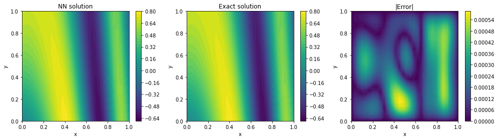
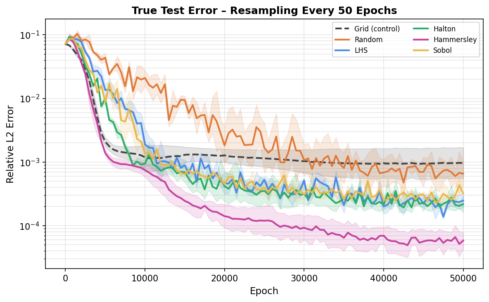

# Physics-Informed Neural Networks

Code repository for my MMath Mathematics dissertation at Durham University, supervised by Dr Kasper Peeters.

---

## Overview

This project investigates physics-informed neural networks (PINNs) as a framework for solving differential equations. Starting from the foundations of neural networks and automatic differentiation, it progresses through concrete examples, training difficulties, and modern mitigation strategies, before extending to parametric solution families and operator learning.

The dissertation is built from the ground up for anyone with a solid maths background — no prior knowledge of neural networks or PyTorch is assumed.

---

## Dissertation Structure

**Chapter 1 – Introduction**  
Motivation and context for PINNs, from early work by Lagaris et al. (1998) to the modern revival by Raissi et al. (2019).

**Chapter 2 – Physics-Informed Neural Networks**  
Core theory: network architecture, physics-informed loss functions, automatic differentiation and backpropagation, optimisation algorithms (SGD, Adam, L-BFGS), vanishing gradients, Glorot initialisation, and the Universal Approximation Theorem.

**Chapter 3 – Applications to Differential Equations**  
Solving a coupled ODE system and a 2D Poisson equation following the Lagaris method (hard-enforced boundary conditions). Covers overfitting diagnostics, curriculum learning, collocation point strategies, and quasi-random sampling schemes.

**Chapter 4 – Improving PINN Training**  
Soft-constraint formulation, residual-based adaptive sampling (RAR, RAD), self-adaptive PINNs (SA-PINNs), Fourier feature embeddings to address spectral bias, and causal training for time-dependent problems. Demonstrated on the Allen–Cahn equation.

**Chapter 5 – Solution Families**  
Solution bundles for parametric families of ODEs, and Physics-Informed Deep Operator Networks (PI-DeepONets) for learning solution operators. Applied to the 1D advection equation.

---

## Repository Structure

```
├── Examples/
│   ├── Allen_Cahn/         # Fourier features on the Allen–Cahn equation
│   ├── Bundles/            # Parametric solution bundles
│   ├── Fourier_Features/   # Spectral bias and Fourier feature embeddings
│   ├── Lagaris_Q4/         # Coupled ODE system (Lagaris problem 4)
│   ├── Lagaris_Q6/         # 2D Poisson equation (Lagaris problem 6)
│   ├── PI-DeepONet/        # Physics-informed Deep Operator Network
│   └── SAPINNS/            # Self-adaptive PINNs
│
└── Images/
    ├── Chapter2/           # Neural network diagrams, activation functions
    ├── Chapter3/           # Lagaris Q4 and Q6 results
    ├── Chapter4/           # SA-PINNs, Fourier features, Allen–Cahn plots
    └── Chapter5/           # Solution bundle and DeepONet figures
```

Each example folder contains its own `README` with a description of the experiment, code, and network hyperparameters.

---

## Highlights


*PINN solution to the 2D Poisson equation using random collocation points, alongside the exact solution and pointwise absolute error.*



*Relative error over training for different collocation resampling strategies on the 2D Poisson equation.*

---

## Key Results

- Curriculum learning improved convergence on the coupled ODE from 22% to 100% across 100 random seeds.
- Hammersley quasi-random sampling achieved the lowest relative error ($6.1 \times 10^{-5}$) on the Poisson problem.
- SA-PINNs reduced mean relative error by ~3.4× over standard PINNs with few collocation points.
- Fourier features reduced relative error on Allen–Cahn from $5.2 \times 10^{-1}$ to $8.9 \times 10^{-2}$.
- The PI-DeepONet achieved a median relative $L^2$ error of $0.125$ across 200 test functions on the advection equation.

---

## Dependencies

- Python 3.x  
- PyTorch  
- NumPy  
- Matplotlib  
- DeepXDE (PI-DeepONet example only)

---

## Acknowledgements

This work used Durham University's NCC cluster.

